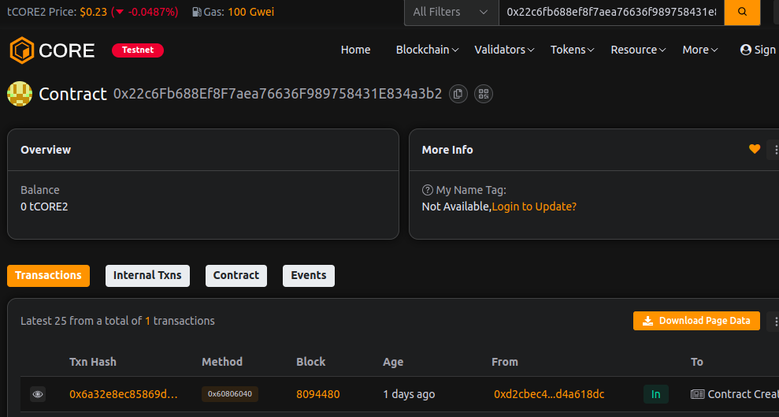

# MetaTransaction Network

### Project Description
MetaTransaction Network is a lightweight meta-transaction execution layer that lets relayers submit transactions on behalf of users. It verifies off-chain signatures, enforces nonces to prevent replay, and executes encoded function calls in a gas-efficient manner.

### Project Vision
Enable gasless and UX-friendly interactions by separating transaction payers (relayers) from users while maintaining on-chain signature verification and replay protection. Designed as a small, auditable primitive that can be integrated into dApps and forwarder/relayer infrastructures.

### Key Features
- executeMetaTransaction(address user, bytes functionData, bytes signature) — verify user's ECDSA signature, increment nonce, and execute the provided functionData via a low-level call. Emits MetaTransactionExecuted(user, relayer, functionData).
- getNonce(address user) view — per-user nonce for replay protection used when signing meta-transactions.
- getMessageHash / recoverSigner / splitSignature — helper utilities for creating/verifying the signed payload (eth-signed message prefix) and extracting r,s,v.
- Simple on-chain relayer model: minimal surface area, event hooks for indexing, and non-custodial execution.

### Future Scope
- Adopt EIP-712 / typed structured data for safer domain-separated signing.
- Relayer reimbursement patterns (gas payment, ERC-20 refunds) and meta-tx fee models.
- Trusted forwarder / ERC‑2771 compatibility and relayer whitelisting.
- Batched meta-transactions and gas-optimization improvements.
- Comprehensive security review and best-practice hardening (reentrancy checks, access controls).

### Contract address:
0x22c6Fb688Ef8F7aea76636F989758431E834a3b2
